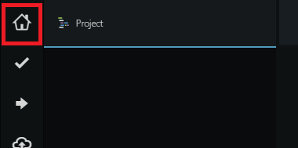
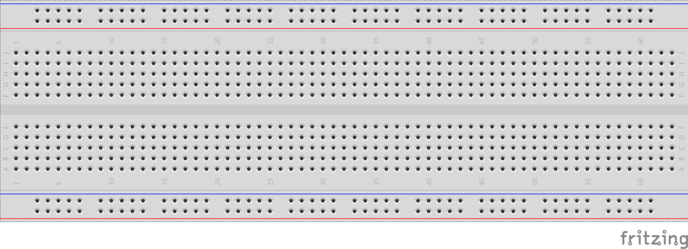
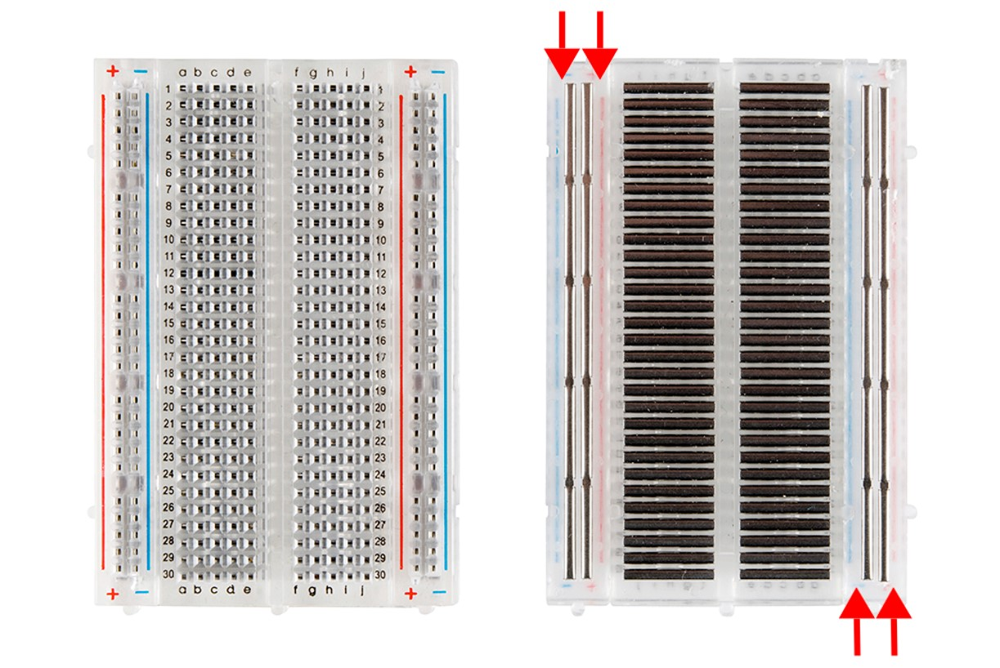
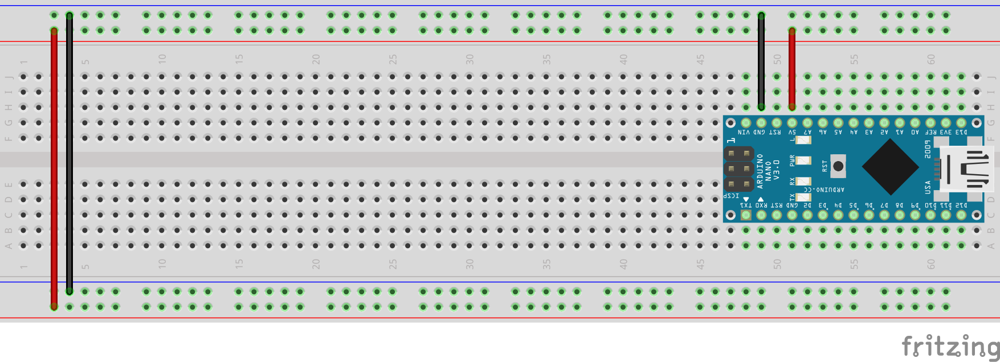
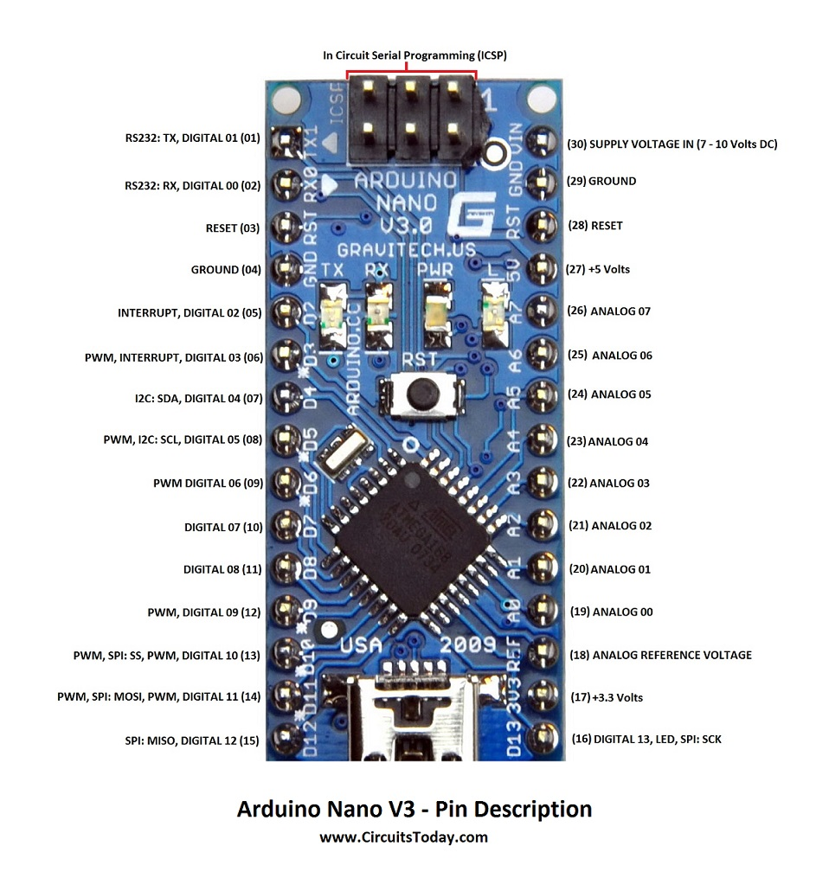
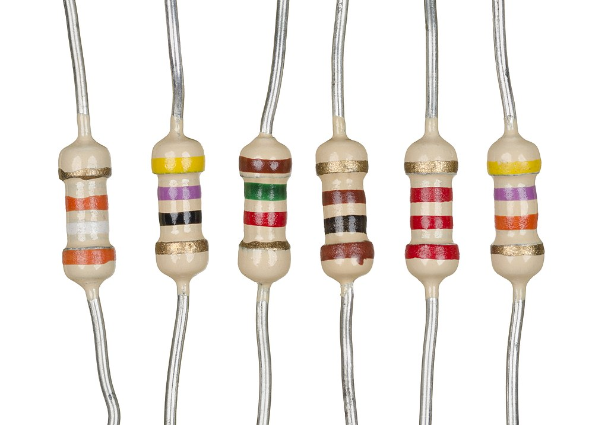
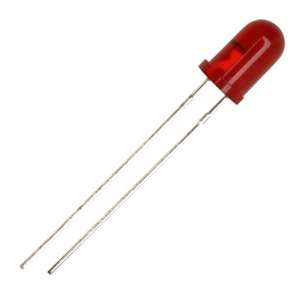

[[section-tools]]
== tools

=== Atom text editor and PlatformIO IDE

In this guide, we will use Atom, the hackable text editor by
Github(https://atom.io/) and add PlatformIO(https://platformio.org/) to
it, which is an Integrated Development Environment (IDE) for hardware
that integrates with it. In order to compile (build) and upload code,
you need to open the project folder with PlatformIO. If you have the
Github folder, you have a project folder for each exercise. In order to
open the folder follow these steps:

* open PlatformIO home page, if it wasn’t done by default
+

* click on open projects
+

* click on the folder for the project you want to open

All of the projects folder included are blank, except for new code, that
is included the first time it is seen. They are in a stable state that
compiles and works, but do nothing.

=== Breadboard

The breadboard, also called a solderless board, allows someone to create
an electronic prototype without having to solder anything.

On a breadboard, lines are considered a single connection. In other
words, all connection on a single line is the same as if they were
soldered together. The line division look like this:

[#fig:breadboard_div]#[fig:breadboard_div]#

Lines are defined by number, so line one is A,B,C,D,E as one line and
F,G,H,I,J is another one. The two small borders are linked as columns
instead of line and are usually used to share power and ground lines. A
"blank" connection usually looks like this:

[#fig:breadboard_blank]#[fig:breadboard_blank]#

This set up, in which an Arduino Nano is added, have the ground line
following the blue line and the 5v line following the red. Whenever
something is connected to a line connected to an Arduino pin, it is
linked to it.

=== Arduino Nano

While there is a lot of Arduino variation, we will proceed with the Nano
edition, for no other reasons that it is cheaper to buy usually. It does
require you to solder it, but all exercise can be done with a regular
Arduino Uno or Duo. The default pinout, or connection emplacement, is:

[#fig:onboard_pinout]#[fig:onboard_pinout]#

For now, it is not needed to understand the difference between analogue
and digital, as we will explain it in due time. Simply know that if the
code use "digitalWrite" or "digitalRead", you must connect to the
digital pin and vice-versa for analogue. A pin defines a connector, like
Analog03 or GROUND.This will become clearer when we reach a certain
point in the exercises.

=== Raspberry pi

The raspberry pi used in the exercises here is the regular model. Any
versions works but we assume this layout:

image:../images/Raspberry-GPIO.jpg[Pi’s connection schematic]

[#fig:rasp_pinout]#[fig:rasp_pinout]#

=== Resistor

Resistors are a key componant of an electric circuit. In all of our
connection, a resistance is required. Where the resistance is applied
depends on what you try to connect. Again, internet is your friend. In
the exercises here, we will give you this information. Since it is a
tutorial and most of the circuits will run for a short amount of time,
any resistance provided will probably work, unless stated otherwise.
Please remember that if you develop a long-running system at home, or
require precision work like a temperature reading,you should use the
correct resistance. Usually, a Google search of the sensor you want to
use will tell you what resistance to use. For more information on
resistances, the tutorial at Sparkfun on the subject is highly
recommended.
footnote:[https://learn.sparkfun.com/tutorials/resistors/all]

=== LED

The LED will serve as our example for output, as it can be both simple 2
pins (power and ground) or 4 pins (ground and one power input per
colour). Most others output will use either a simple 2 pins setup or use
controls pins.

image:../images/rgbled.png[4 pin led]

=== Sensors

Sensors are used in this document as generic input devices, it can be a
temperature probe, a button, etc. Sensor can be analogic or digital,
and, in some case, both. A digital sensor use the digital pins and
vice-versa. A tutorial on the differences between analogic and digital
can be found on the Sparkfun website.
footnote:[https://learn.sparkfun.com/tutorials/analog-vs-digital/all] A
gross simplification would be that digital either 1 or 0 (HIGH or LOW,
On or OFF), representing the presence of current, and that analogic is a
range(i.e. from 0 to 1.073) representing the voltage of the signal.
Also, as of why ever use the "less precise" digital, it is faster to
read ones or zeroes than to read a precise value. The reality is a
little bit more complex(it includes things like wavelength) but this
should suffice.

== Arduino

____
Arduino is an open-source hardware and software company, project and
user community that designs and manufactures single-board
micro-controllers and micro-controller kits for building digital devices
and interactive objects that can sense and control objects in the
physical and digital world. Its products are licensed under the GNU
Lesser General Public Licence (LGPL) or the GNU General Public Licence
(GPL),[1] permitting the manufacture of Arduino boards and software
distribution by anyone. Arduino boards are available commercially in
already assembled form or as do-it-yourself (DIY) kits.
____

footnote:[https://en.wikipedia.org/wiki/Arduino[Wikipedia]]

=== Arduino specificities

A base Arduino project code will look like this:

....
    #include <Arduino.h>

    void setup() {

    }

    void loop() {

    }
....

The setup section is where you initialize your variables that are needed
for the whole program. Most of the code will be put inside the loop
section. This is the equivalent of an infinite while loop that continues
as long as the Arduino board is supplied with power. Code can be put
outside of those two sections, but those sections need to be there. As
we go through some exercise, it will make more and more sense.
