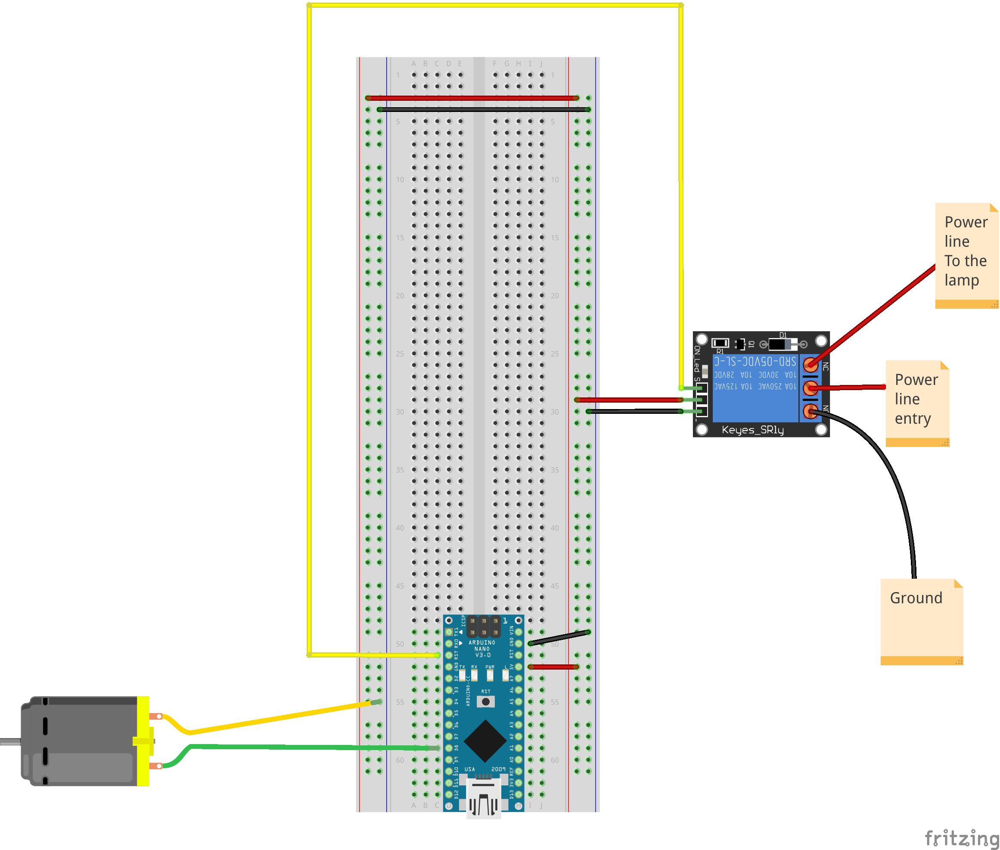

[[section-raspberry-pi-projects]]
== Raspberry Pi

The Raspberry Pi is a single-board computer. It differs a lot from
Arduino in the computing power and infrastructure sense. It contains a
full-fledge ARM processor (quad cores in the latest versions) and up to
a gig of ram. While in Arduino we had to code in C like language, in pi,
we can use any language supported in ARM Linux distribution. We can do
so because the RPi (Raspberry Pi) run full OSs and not just machine
code. Java and .net core both have ARM Linux distribution aiming at the
Pi, with Microsoft working on a full IoT Windows OS for the RPi. What is
really useful with the Pi is that it can link with an Arduino with
serial USB and interact with it, allowing to use complex automation on
small size scale and with low power consumption, since both the RPi and
the Arduino are powered by USB (5v currant).

=== Project 1: Automated garden

This project will show how to use a RPi to control an arduino with
Serial and transfert data and command. While most of the tasks could be
done with hard-coded values with the Arduino alone, enabling
communication between the two devices open the way to a lot of complex
automation systems. The garden is composed of a Raspberry Pi, serving as
a controller, an Arduino controlling sensors, pump and lights, a lamp
and a small water pump.

==== Arduino

The Arduino is in charge of taking readings from sensors and executing
commands from the RPi. The informations the controller(in this case the
Raspberry Pi) needs is the light level, the moisture of the ground and
the temperature. The information the Arduino can receive is to water the
plants and turn on or off the lamps. For the pump, we can either use an
Arduino controlled one or a pump activated with a relay switch. Since
the lights will already use switch, this is gonna use a smaller pump
with direct control. A relay switch allows the controls of external
electricaly powered device, like a lamp, by closing the electric
circuit. It is like a controlled wall switch. Here is the Arduino wiring
diagram, without the sensors,

[#fig:gardenconnection]#[fig:gardenconnection]#

There are two things to keep in mind, they are true for this project and
also any future projects:

* something that draw a lot of current, like a pump or a motor, should
be powered from another source than the micro-controller. Usually, the
red wire should be powered by an external source while the control wire
is connected to the controller. The ground can still be attached to
either.
* If you are not comfortable with high current, do not use relays. You
can control household appliance with it and it is super usefull, but is
it also dangerous if handle improperly. High voltage can kill you, never
treat it like a game.

The Arduino code will look something like that, the rellay, the pump and
the serial connection is explained, the rest was shown earlier.

....
    #include <Arduino.h>
    #include <ArduinoJson.h>

    const int relay = 3;
    const int pump = 8;
    bool lightSwitch = 0;
    int pumptimer = 0;

    void setup() {
        Serial.begin(9600);//this begin the Serial connection
        pinMode(relay, OUTPUT);
        pinMode(pump, OUTPUT);
        while (!Serial) continue; //wait for serial port to be ready
    }

    void SendData(int temperature, int light, int moisture){
        StaticJsonBuffer<200> jsonBuffer; //this might need to grow bigger if there is more sensors this is the byte size of the JsonArray

        JsonObject& root = jsonBuffer.createObject();
        JsonArray& data = root.createNestedArray("data");

        JsonObject& tempSensor = jsonBuffer.createObject();
        tempSensor["sensor"] = "temperature";
        tempSensor["reading"] = temperature;
        data.add(tempSensor);

        JsonObject& moistSensor = jsonBuffer.createObject();
        moistSensor["sensor"] = "moisture";
        moistSensor["reading"] = moisture;
        data.add(moistSensor);

        JsonObject& LightSensor = jsonBuffer.createObject();
        LightSensor["sensor"] = "light";
        LightSensor["reading"] = light;
        data.add(LightSensor);
        root.printTo(Serial);// This prints the json data to the serial port*/
    }
    void ReceiveData(){
        //this assume this data format {"light":1,"pump":2}
        StaticJsonBuffer<200> reception;
        JsonObject& received = reception.parseObject(Serial);
        lightSwitch = received["light"]; //1 == lights on
        pumptimer = received["pump"]; //assumes the controller return a value representing the seconds pumps should run*/
    }

    void loop() {
        SendData(15, 100, 90);
        while(Serial.available() == 0){} //wait for serial data
        ReceiveData();
        /*
        digitalWrite(relay, HIGH);//complete the circuit, turn the light on
        digitalWrite(relay, LOW);//close the light
        digitalWrite(pump, HIGH);//complete the circuit, start the pump
        digitalWrite(pump, LOW);//stop the pump
        */
        digitalWrite(relay, lightSwitch);
        if(pumptimer>0){
            digitalWrite(13, HIGH);
            delay(pumptimer*1000);//convert to milliseconds
            digitalWrite(13, LOW);
        }

    }
....

==== RPi

This assume you have a Raspberry Pi with an OS installed, you can use
https://www.raspberrypi.org/downloads/raspbian/[the raspian
distribution]. Once this is installed, you can use the programming
langage of your choice. For ease of use, we will use python. At this
point, we are doing regular programmation, without the sensors, but
using serial connection to talk to the Arduino, that have all the
sensor. Here is a python file that interact with the Arduino

....
    import json
    import serial
    import time

    ser = serial.Serial('/dev/ttyUSB0', 9600, timeout = 1) //this assume no other usb serial connection are actives
    temperature = 0
    lightLevel = 0
    readOut = 0   #chars waiting from laser range finder

    print ("Starting up")
    connected = False

    while True:
        while True:
            try:
                print ("Attempt to Read")
                readOut = ser.readline()
                jsonDecoded = json.loads(readOut)
                print ("Reading: ", jsonDecoded)
                #temperature = jsonDecoded["light"]
            break
            except:
            time.sleep(10)
            pass
        commands = {
        "light":1,
        "pump":2
        }
        print ("Writing: ",  commands)
        ser.write(json.dumps(commands).encode())
        time.sleep(10)
        ser.flush() #flush the buffer

....

==== Connecting both

Plug the USB cable from the RPi to the Arduino and start the Python
code. Done.
